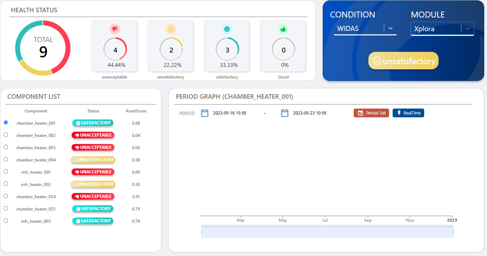

# (기업 연계)반도체 제조 로봇 상태 관리 시스템

기간: 2023.04 ~ 2023.05
기술스택: MongoDB, Python, React, SSE, SpringBoot, ec2, s3
담당역할: 서버 환경 구축, db 스키마 설계, api 개발
프로젝트 개요:  반도체 제조 로봇 상태 진단 및 관리 시스템 서비스입니다. 이 시스템은 wPHM(WONIK Prognostics and Health Management)이라는 AI 예측/탐지 모델을 기반으로 합니다. 이 시스템은 로봇의 상태를 진단하고 관리하는 데 사용되며, 로봇의 고장을 예방하고 생산성을 향상시키는 데 도움이 될 것입니다.

## ✔️**프로젝트 목표**

- wPHM의 정보를 사용자에게 제공하기 위한 대시보드 형태의 UI를 개발합니다.
- 데이터베이스 및 객체 스토리지를 구축합니다.
- Docker 기반 가상 서비스를 구축합니다.
- wPHM 예측 알고리즘 인터페이스를 구축합니다.
- 1년이 데이터(15만개 x 파라미터 갯수) 를 5초안에 그래프로 보여줍니다.
- UI 디자인, 데이터베이스 설계서, 시스템 설계서, DFD 등의 문서를 생성합니다.
- 웹 서버 UI를 생성합니다.
- 각 설비별 데이터베이스를 생성합니다.

## ✔️**담당 역할**

### 1) 서버 환경 구축
- 원격 서버에는 파이썬을 사용하여 테스트 데이터를 주기적으로 생성하고, 이를 내 서버에서 감지하여 파일 가져옴.
- AWS EC2에 도커를 사용하여 원격서버, BackEnd, FrontEnd, 감지 컨테이너 별로 관리
- 원격 서버에서 데이터가 생기면 데이터를 가져와 S3에 저장, 가공되어 몽고DB에 저장
- 새로운 데이터가 감지되면 SSE를 통해 실시간 그래프 데이터 업데이트
- Jenkins와 webhook 을 이용하여 CI/CD 자동화 구축

### 2) db 설계 및 구축

- 초기 트리 구조로 데이터를 몽고DB에 저장 -> 서버가 다운되거나 오류가 뜸
- 공정 별로 튜플을 나누어 저장하는 방식으로 변경 -> 40초 이상 시간 소요
- 노드 별로 나눠 저장하는 방식으로 변경 - > 30초 이상 시간 소요
- 인덱싱과 GZIP, Sharding 을 적용 -> 평균 7초 내외 소요

### 3) 그래프 데이터 api 개발
- 간단한 쿼리문을 사용하여 필요한 데이터를 가져왔지만, 대용량의 데이터 처리에 있어서는 비효율적
- 시계열 데이터를 처리해야 했기 때문에, $match 연산자로 필요한 기간의 데이터만 선택하고, $group 연산자로 각 로봇 상태에 따른 데이터를 그룹화, $project 연산자를 사용하여 필요한 형태로 데이터를 재구성
- API 응답 시간이 초기 설계 때보다 약 50% 가량 단축

## [성과]
1) 대용량의 데이터 처리 및 최적화 경험을 통해 성능 최적화에 대한 심도 있는 이해와 경험
2) 개발 역량과 문제 해결 능력, 그리고 협업 능력 향상

## ✔️**기술 스택**

● SpringBoot,  MongoDB, aws S3(객체 스토리지), aws ec2(Ubuntu), Docker, Python, Java, React, Inotifywait, Pandas, Sharding

## ✔️용어 및 약어 정의

● wPHM: WONIK Prognostics and Health Management
● 상태 진단: 로봇의 상태를 평가하는 프로세스
● 관리: 로봇의 상태를 모니터링하고 유지 관리하는 프로세스
● 예측/탐지 모델: 로봇의 고장을 예측하거나 탐지하는 데 사용할 수 있는 AI 모델
● 데이터베이스: 데이터를 저장하고 검색할 수 있는 시스템
● 객체 스토리지: 대량의 데이터를 저장할 수 있는 시스템
● Docker: 애플리케이션을 컨테이너화하는 데 사용할 수 있는 도구
● 클라이언트: 반도체 제조 공정에 사용되는 로봇을 사용하는 회사
● 개발자: 시스템을 개발하는 사람
● 관리자: 시스템을 관리하는 사람
● 개발 환경: 시스템을 개발하는 데 사용되는 환경
● UI: 사용자 인터페이스
● DB: 데이터베이스
● DFD: 데이터 흐름 다이어그램

## ✔️전체 프로젝트 논리 흐름도(Use Diagram)

## ✔️데이터 흐름도

## ✔️Back-end DB 설계 내용

 트리의 노드는 Name, Value, Parent, Date라는 네 가지 필드를 가지고 있고 Name, Date, Parent
필드를 사용하여 인덱싱합니다. Name 필드는 노드의 이름을 저장하는 데 사용됩니다. Value 필드는
노드의 값을 저장하는 데 사용됩니다. Parent 필드는 노드의 부모 노드의 이름을 저장하는 데
사용됩니다. Date 필드는 노드가 생성된 날짜를 저장하는 데 사용됩니다.

 트리의 노드를 빠르고 효율적으로 찾기 위해 이러한 스키마를 설계하였습니다. 예를 들어 Name
필드를 사용하여 특정 이름을 가진 노드를 찾을 수 있습니다. Value 필드를 사용하여 특정 값을 가진
노드를 찾을 수 있습니다. Parent 필드를 사용하여 특정 노드의 자식 노드를 찾을 수 있습니다. Date
필드를 사용하여 특정 날짜에 생성된 노드를 찾을 수 있습니다.

## ✔️Front-end User Scenario 도식도

## ✔️회고

서버 사양이 더 좋았거나 서버가 더 있었다면 속도를 더 개선할 수 있었는데 하나의 서버로 작업하다 보니 서버도 자주 죽고 시간도 오래 걸린 것 같아 아쉬웠습니다.